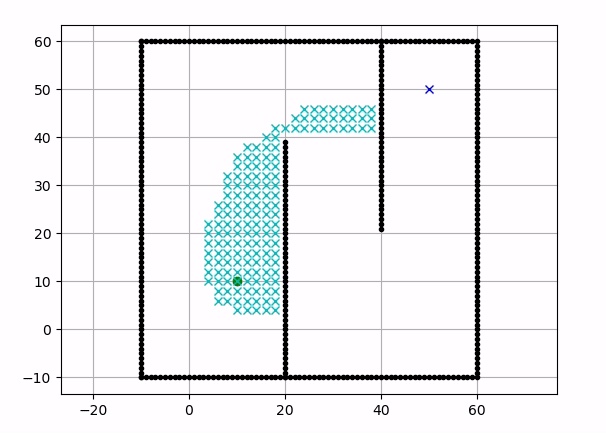

# bir_turtlebot-expl-a-star

This repository contains a **ROS** package to implement navigation with the  **A\*** algorithm on the **turtlebot 3**. A* (pronounced "A-star") is a path search algorithm.

**Keywords**: A*, TurtleBot3, ROS

**Author**: [Anderson Lima](https://github.com/aldenpower) 
Affiliation: [BIR - Brazilian Institute of Robotics](https://github.comBrazilian-Institute-of-Robotics)  
Maintainer: Anderson Lima, eng.andersonfsl@gmail.com

_For more details visit [RASC](https://mhar-vell.github.io/rasc/) and [Star navigation](https://mhar-vell.github.io/rasc/2021-12-10-turtlebot3-astar-navigation/)_
### A star example

## Supported Versions
- **ROS Noetic**: Tested under [ROS](https://www.ros.org/) Noetic and Ubuntu 20.04

## Installation 

_Create a workspace folder_

1 - `mkdir -p ~/turtle_ws/src`

_Enter in the source folder of the workspace_

2 - `cd ~/turtle_ws/src`

_Clone the turtlebot3 repositories_

3 - `git clone -b noetic-devel https://github.com/ROBOTIS-GIT/DynamixelSDK.git`

4 - `git clone -b noetic-devel https://github.com/ROBOTIS-GIT/turtlebot3_msgs.git`

5 - `git clone -b noetic-devel https://github.com/ROBOTIS-GIT/turtlebot3.git`

_Clone this respository_

6 - `git clone https://github.com/Brazilian-Institute-of-Robotics/bir_turtlebot_expl-a-star.git`

_Build your workspace_

7 - `cd ~/turtle_ws && catkin_make`

## Run the simulation

Source your workspace:

`source ~/turtle_ws/devel/setup.bash`

Run the turtlebot 3 house world with: 

`roslaunch ttb_astar turtlebot3_house.launch`

You can run the navigation with two launchs:

- **Navigation with Gmapping**

    _This launch will run the SLAM Gmapping Node with Move base planning the path with A*_

    - `roslaunch ttb_astar navigation_a_star.launch`

- **Navigation with AMCL**

    _This launch will run the AMCL with the house map with Move base planning the path with A*. The navigation with AMCL is more precise._

    - `roslaunch ttb_astar navigation_a_star_amcl.launch`