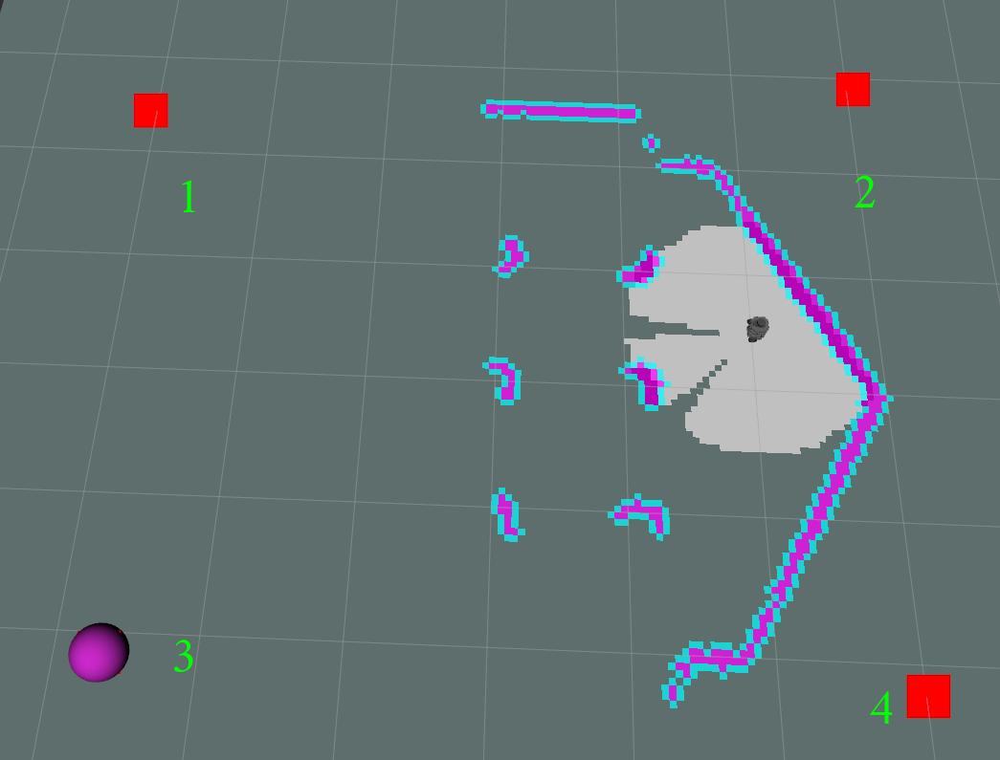
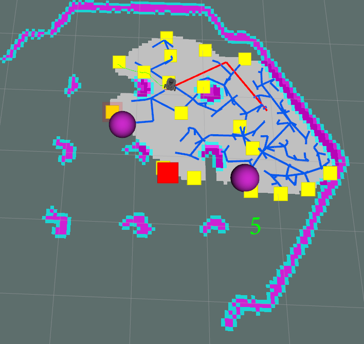

# bir_turtlebot-expl

This repository contains 4 **ROS** packages to implement navigation with the  **A\***, **PRM**, **D\***, **RRT** on the **turtlebot 3**.

**Keywords**: TurtleBot3, ROS, A*, D*, RRT, PRM

**Author**: [...]() 
Affiliation: [BIR - Brazilian Institute of Robotics](https://github.comBrazilian-Institute-of-Robotics)  
Maintainer: Anderson Lima, eng.andersonfsl@gmail.com

_For more details visit [RASC](https://www.braziliansinrobotics.com/), [Star navigation](https://www.braziliansinrobotics.com/2021-12-10-turtlebot3-astar-navigation/)_, ...

## Supported Versions
- **ROS Noetic**: Tested under [ROS](https://www.ros.org/) Noetic and Ubuntu 20.04

## Installation base

_Create a workspace folder_

1 - `mkdir -p ~/turtle_ws/src`

_Enter in the source folder of the workspace_

2 - `cd ~/turtle_ws/src`

_Clone the turtlebot3 repositories_

3 - `git clone -b noetic-devel https://github.com/ROBOTIS-GIT/DynamixelSDK.git`

4 - `git clone -b noetic-devel https://github.com/ROBOTIS-GIT/turtlebot3_msgs.git`

5 - `git clone -b noetic-devel https://github.com/ROBOTIS-GIT/turtlebot3.git`

6 - `git clone -b noetic-devel https://github.com/ROBOTIS-GIT/turtlebot3_simulations`

_Clone this respository with **--recurse-submodules** command, it will automatically initialize and update each submodule in the repository_

7 - `git clone --recurse-submodules https://github.com/Brazilian-Institute-of-Robotics/bir_turtlebot_expl.git`

_Build your workspace_

8 - `cd ~/turtle_ws && catkin_make`

_Source your workspace_

9 - `source ~/turtle_ws/devel/setup.bash`

_Export turtlebot3 model of your choice_

10.1 - `export TURTLEBOT3_MODEL=burger`

10.2 - `export TURTLEBOT3_MODEL=waffle`

_Run a Turtlebot3 world of your choice_

11.1 - `roslaunch turtlebot3_gazebo turtlebot3_house.launch`

11.2 - `roslaunch turtlebot3_gazebo turtlebot3_world.launch`

## A* run

### Run the navigation

You can run the navigation with two launchs:

- **Navigation with Gmapping**

    _This launch will run the SLAM Gmapping Node with Move base planning the path with A*_

    1.1 - `roslaunch ttb_astar navigation_a_star.launch`

- **Navigation with AMCL**

    _This launch will run the AMCL with the house map with Move base planning the path with A*. The navigation with AMCL is more precise._

    1.2 - `roslaunch ttb_astar navigation_a_star_amcl.launch`

## RRT run

_Download the image that will be used by docker through the link_

1 - [rrt image link](https://drive.google.com/file/d/19lIg9ob_BZekCTNvuxKBq69jxl-yBjjp/view?usp=sharing)

_Load the image to docker_

2 - `docker load < kineticrrt.tar.gz`

_Run the navigation launch_

3 - `roslaunch ttb_rrt navigation_rrt.launch`

_Create the container through the image_

4 - `docker run -it --privileged --net=host kinetic/rrt`

_Run the rrt exploration launch inside the container_

5 - `roslaunch rrt_exploration simple.launch`

6 - _In the rviz select the first four points that represents the region to explore_

7 - _Select the fifth point that represents the point that the turtle will start to explore_

# PRM run

### Run the navigation

You can run the navigation with two launchs:

- **Navigation with Gmapping**

    _This launch will run the SLAM Gmapping Node with Move base planning the path with PRM_

    1.1 - `roslaunch turtlebot_prm navigation_prm.launch`